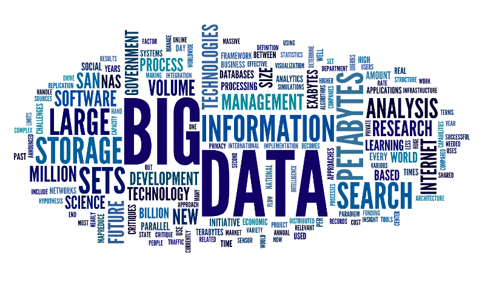

---
##Informatique décisionnelle (BI) ?

- Statistique descriptive,

- Données à forte densité,

- Grande volumétrie mais faible dimensionnalité, 

- Mesurer des phénomènes, 

- Détecter les grandes tendances.

.center[]
---

##Informatique décisionnelle (BI) ?
.center[]
---

##Informatique décisionnelle (BI) ?
.center[]
---

##Big Data ?
.center[]
---

##Big Data ?
- Statistique inférentielle, 

- Données à faible densité, 

- Grande volumétrie et forte dimensionnalité,

- Utilisation de la volumétrie pour inférer,

- Capacité prédictive.

.center[]
---

##Big Data ?
.center[]
---

##Big Data ?
.center[]
---

##Limite actuelle du Big Data ? 
.center[]
---

## Deux exemples d'application
- Recherche de signatures de défaut en microélectronique

.center[]
--

- Détection des renversements de tendances pour la pharmacovigilance

.center[]
---

## Nouveau métier : Data Scientist
.center[]

