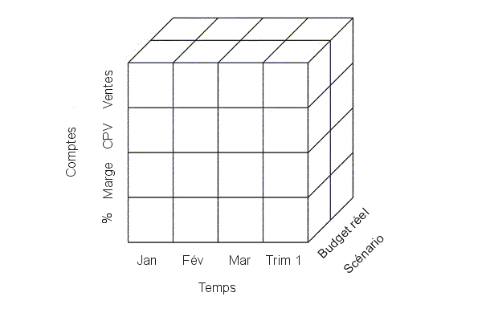

class: center, middle

# Fouille de grosses données et extraction de connaissances
### Sébastien NEDJAR (MCF AMU - LIF)
---

##Equipe Bases de Données Avancées à l'IUT 
- Bases de données multidimensionnelles,

- Entrepôt de données,

- Fouille de données,

- Extraction des connaissances.
.center[]
---

##Informatique décisionnelle (BI) ?
- Statistique descriptive,

- Données à forte densité,

- Grande Volumétrie mais faible dimensionnalité, 

- Mesurer des phénomènes, 

- Détecter des tendances.

.center[]
---

##Informatique décisionnelle (BI) ?
.center[]
---

##Informatique décisionnelle (BI) ?
.center[]
---

##Big Data ?
.center[]
---

##Big Data ?
- Statistique inférentielle, 

- Données à faible densité, 

- Grande Volumétrie et forte dimensionnalité,

- Utilisation de la volumétrie pour inférer,

- Capacité prédictive.

.center[]
---

##Big Data ?
.center[]
---

##Big Data ?
.center[]
---

##Limite actuelle du Big Data ?
Les outils utilisés à l’heure actuelle ne sont pas encore en adéquation avec les volumes de données engendrés dans l’exploration de big data. 

.center[]
---

## Deux exemples d'application
.center[]
---

## Recherche de signatures de défaut en microélectronique
 - En micro-électronique, la fabrication de composants est un processus industriel complexe.
 
 - Chaque étape du processus est susceptible d’engendrer des composants défectueux.
 
 - Pour les détecter au plus tôt, de très nombreux tests sont effectués.
 
 - Que ce soit pour prédire les défaillances ou en analyser les origines, des algorithmes de recherche multidimensionnel d'outliers (valeurs atypiques, données erronées ,signaux faibles) ont facilité ce travail.
.center[]  
---

## Détection des renversements de tendances pour la pharmacovigilance
- En pharmacovigilance on cherche à évaluer les effets indésirables résultant de l'usage des médicaments.

- Actuellement la détection repose principalement sur les médecins (obligation réglementaire). 

- L'établissement de la causalité est possible uniquement si elle est évidente et immédiate.

- L'affaire du Mediator est l'exemple le plus patent des limites du système actuel de la pharmacovigilance.

.center[]   
---

## Conclusion
- L'émergence du phénomène Big Data a apporté un nouvel éclairage aux travaux d'analyse de données.

- La profusion de données non encore exploitable est une mine d'or pour le data scientist.

- Tous les étudiants arrivant sur le marché du travail devront connaitre 

- Il y a encore de nombreuses questions de fiabilité, d'éthiques ou d'usage.

.center[]
